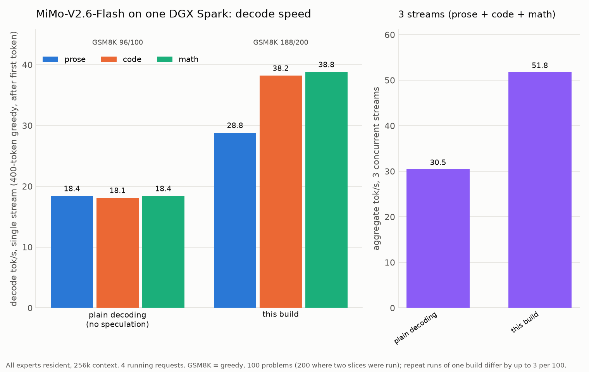

# MiMo-V2.6-Flash-SD — MiMo-V2.6-Flash on one DGX Spark

A compressed build of **MiMo-V2.6-Flash-RL** (309B-parameter MoE, 15B active, 256 experts per layer) that runs on a
**single DGX Spark (GB10, 128 GB unified memory)** with sglang: every expert resident, 256k context, speculative
decoding with the model's own MTP layers. This repository holds what is needed to **run** it: the patched sglang files,
the launcher and the benchmark scripts. The weights are on Hugging Face (see *Get the weights*).



## Numbers (one DGX Spark, greedy, 400-token generations, decode rate after the first token)

| | single stream | 3 concurrent streams |
|---|---|---|
| prose | 28.8 tok/s | |
| code | 38.2 tok/s | |
| math | 38.8 tok/s | |
| aggregate | | **51.8 tok/s** |
| GSM8K (greedy, 200 problems) | 188 / 200 | |
| long context | needle passes at 254k tokens; decode 14 tok/s after a 154k-token prompt | |
| resident weights | ~87 GB | |

Repeat runs on this class of machine differ by up to ±5 % in speed and ±3 GSM8K problems per 100.

## Requirements
* DGX Spark (GB10, 128 GB unified). Nothing else was tested.
* Docker with GPU access and the image `lmsysorg/sglang:qwen38flashnext` (~30 GB).
* ~95 GB of disk for the weights; ~105 GB of the unified pool while serving. Do not run another GPU job beside it.

## Get the weights
```bash
pip install -U huggingface_hub
hf download sdworld/MiMo-V2.6-Flash-SD --local-dir ./MiMo-V2.6-Flash-SD
```

## Run
```bash
docker pull lmsysorg/sglang:qwen38flashnext
git clone <this repo> && cd MiMo-V2.6-Flash-SD
CKPT=/path/to/MiMo-V2.6-Flash-SD ./run.sh        # port 8936, model name "mimo-sd"; first load ~10 min
docker logs -f mimo-sd
curl -s localhost:8936/v1/chat/completions -H 'Content-Type: application/json' \
  -d '{"model":"mimo-sd","messages":[{"role":"user","content":"Explain speculative decoding in two sentences."}],"max_tokens":200}'
./stop.sh
```

`run.sh` knobs (env vars): `PORT`, `NAME`, `CTX` (default 262144), `MEMFRAC` (0.85), `MAXREQ` (4 concurrent
requests), `STEPS`/`DRAFT` (speculative depth, default 2/3; `STEPS=3 DRAFT=4` is faster on math and slower on
prose). Extra arguments are passed to `sglang.launch_server`. The OpenAI-compatible API is at `/v1`; the model
thinks by default and returns the think block inline.

## Verify on your box
```bash
python3 bench/speed_probe.py mybox                           # prose / code / math single stream, then 3 streams
python3 bench/gsm8k_eval_greedy.py                           # N=100 by default; OFFSET=100 for the next 100 problems
python3 bench/needle.py 8936 mimo-sd 200000                  # needle-in-a-haystack at ~150k tokens
```

## License
MIT (this repository); the weights derive from Xiaomi's MiMo-V2.6-Flash-RL (MIT) and the patched files from SGLang
(Apache 2.0).
